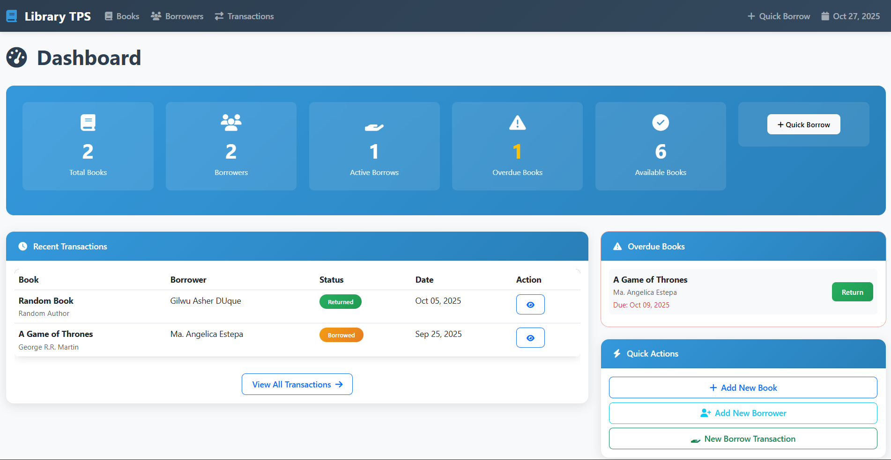
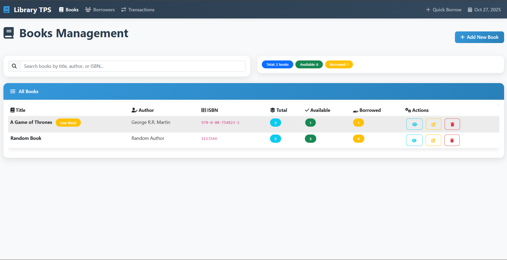
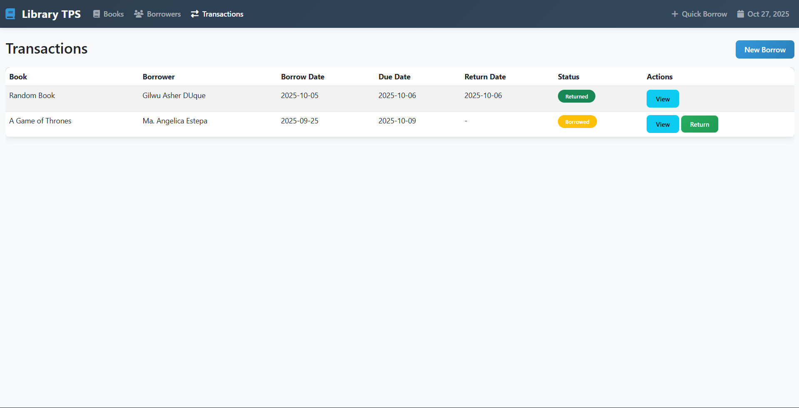
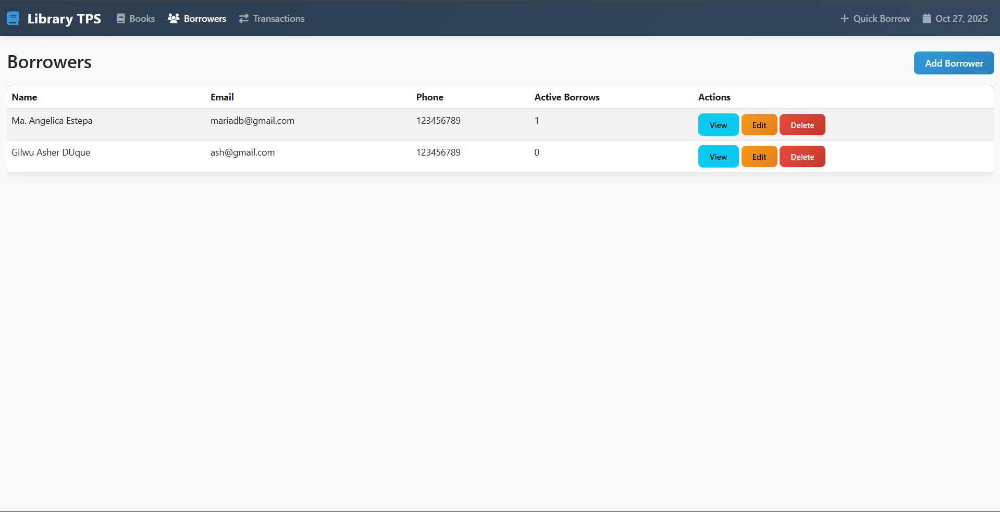

# 📚 Library Transaction Processing System (TPS)


## 📖 Description / Overview

The **Library Transaction Processing System (TPS)** is a comprehensive web-based library management application built using **Laravel MVC architecture**. This system streamlines library operations by managing books, borrowers, and borrowing transactions with an intuitive, modern user interface.

The system provides real-time inventory tracking, automated overdue alerts, and a professional dashboard for monitoring library activities. It demonstrates the implementation of RESTful CRUD operations, database relationships, and modern web development practices.

---

## 🎯 Objectives

This project aims to achieve the following learning outcomes:

- ✅ **Implement Laravel MVC Architecture** - Demonstrate proper separation of concerns between Models, Views, and Controllers
- ✅ **Master Database Relationships** - Create and manage complex Eloquent relationships (hasMany, belongsTo)
- ✅ **Build RESTful CRUD Operations** - Implement Create, Read, Update, Delete functionality for multiple entities
- ✅ **Design Professional UI/UX** - Create a modern, responsive interface using Bootstrap 5
- ✅ **Apply Business Logic** - Implement real-world inventory management and transaction processing
- ✅ **Practice Form Validation** - Ensure data integrity through server-side validation
- ✅ **Organize Views Efficiently** - Structure Blade templates in logical folder hierarchies

---

## ✨ Features / Functionality

### **Core Features**

#### 📚 **Book Management**
- Add new books with title, author, ISBN, and quantity
- Edit existing book information
- Delete books from the system
- View detailed book information and transaction history
- Real-time inventory tracking (total vs available copies)
- Visual indicators for stock status (In Stock, Low Stock, Out of Stock)
- Live search functionality to find books instantly

#### 👥 **Borrower Management**
- Register new library members with contact details
- Update borrower information
- Delete borrower records
- View borrower profiles with complete borrowing history
- Track active borrows per member

#### 🔄 **Transaction Processing**
- Process book borrowing with automatic inventory updates
- Record borrow dates and due dates
- Handle book returns with one-click functionality
- Track transaction status (Borrowed/Returned)
- Automatic overdue detection
- Complete transaction audit trail

#### 📊 **Dashboard & Analytics**
- Real-time statistics cards (Total Books, Borrowers, Active Transactions, Overdue Books)
- Recent transactions overview
- Overdue books alert panel with quick return actions
- Quick action shortcuts for common tasks
- Visual status indicators and badges

### **Advanced Features**

- **Automated Inventory Management** - Available quantity automatically adjusts on borrow/return
- **Overdue Detection** - System identifies and highlights overdue books with visual alerts
- **Responsive Design** - Fully functional on desktop, tablet, and mobile devices
- **Live Search** - Real-time filtering of books without page reload
- **Data Validation** - Comprehensive form validation with user-friendly error messages
- **Relationship Queries** - Efficient eager loading to prevent N+1 query problems
- **Professional UI** - Modern gradient design with smooth animations and hover effects

---

## 🛠️ Installation Instructions

### **Prerequisites**

Ensure you have the following installed:
- PHP 8.0 or higher
- Composer
- MySQL or PostgreSQL database
- Node.js and NPM (optional, for asset compilation)
- Web server (Apache/Nginx) or use Laravel's built-in server

### **Step-by-Step Installation**

#### **1. Clone or Download the Project**
```bash
# If using Git
git clone https://github.com/yourusername/library-tps.git
cd library-tps

# Or download and extract the ZIP file
```

#### **2. Install Dependencies**
```bash
# Install PHP dependencies
composer install

# Install Node dependencies (optional)
npm install
```

#### **3. Environment Configuration**
```bash
# Copy the example environment file
cp .env.example .env

# Generate application key
php artisan key:generate
```

#### **4. Configure Database**
Edit the `.env` file and set your database credentials:
```env
DB_CONNECTION=mysql
DB_HOST=127.0.0.1
DB_PORT=3306
DB_DATABASE=library_tps
DB_USERNAME=your_username
DB_PASSWORD=your_password
```

#### **5. Create Database**
Create a new database named `library_tps` in your MySQL server:
```sql
CREATE DATABASE library_tps;
```

#### **6. Run Migrations**
```bash
# Create all database tables
php artisan migrate
```

#### **7. Start the Development Server**
```bash
# Start Laravel's built-in server
php artisan serve
```

#### **8. Access the Application**
Open your browser and navigate to:
```
http://localhost:8000
```

---

## 🚀 Usage

### **Getting Started**

#### **1. Access the Dashboard**
- Navigate to `http://localhost:8000`
- You'll see the main dashboard with statistics overview

#### **2. Add Books to Library**
```
Dashboard → Books → Add New Book
```
- Enter book title, author, ISBN, and quantity
- Click "Add Book" to save
- The book will appear in the Books list

#### **3. Register Borrowers**
```
Dashboard → Borrowers → Add New Borrower
```
- Enter borrower's name, email, and phone number
- Click "Add Borrower" to register
- View all registered borrowers in the list

#### **4. Process a Book Borrowing**
```
Dashboard → Transactions → New Borrow
```
- Select a book from the dropdown (only available books shown)
- Choose a borrower
- Set borrow date and due date
- Click "Create Transaction"
- Available quantity automatically decreases by 1

#### **5. Return a Book**
```
Dashboard → Transactions → Find the transaction → Click "Return"
```
- Locate the borrowed book in the transactions list
- Click the "Return" button
- Confirm the return
- Available quantity automatically increases by 1

#### **6. Search for Books**
```
Dashboard → Books → Use the search bar
```
- Type book title, author, or ISBN in the search field
- Results filter in real-time as you type

#### **7. View Reports and Details**
- Click "View" on any book to see detailed information and transaction history
- Click "View" on any borrower to see their borrowing history
- Check the Dashboard for overdue alerts

---

## 📸 Screenshots

### **Dashboard Overview**
```markdown

*Main dashboard showing statistics, recent transactions, and overdue alerts*
```

### **Books Management**
```markdown

*Books listing with live search and stock indicators*
```

### **Transaction Processing**
```markdown

*Create new borrowing transaction with date selection*
```

### **Borrower Profile**
```markdown

*Borrower details with complete borrowing history*
```

---

## 💻 Code Snippets

### **Book Model with Relationships**
```php
<?php

namespace App\Models;

use Illuminate\Database\Eloquent\Model;

class Book extends Model
{
    protected $fillable = [
        'title', 'author', 'isbn', 'quantity', 'available_quantity'
    ];

    // One book can have many transactions
    public function transactions()
    {
        return $this->hasMany(Transaction::class);
    }

    // Get only currently borrowed transactions
    public function activeBorrows()
    {
        return $this->hasMany(Transaction::class)->where('status', 'borrowed');
    }
}
```

### **Transaction Controller - Borrow Logic**
```php
public function store(Request $request)
{
    // Validate input
    $request->validate([
        'book_id' => 'required|exists:books,id',
        'borrower_id' => 'required|exists:borrowers,id',
        'borrow_date' => 'required|date',
        'due_date' => 'required|date|after:borrow_date',
    ]);

    $book = Book::find($request->book_id);
    
    // Check availability
    if ($book->available_quantity <= 0) {
        return back()->with('error', 'Book is not available!');
    }

    // Create transaction
    Transaction::create($request->all());
    
    // Update inventory
    $book->decrement('available_quantity');

    return redirect()->route('transactions.index')
        ->with('success', 'Book borrowed successfully!');
}
```

### **Blade Template - Books List**
```blade
@extends('layouts.app')

@section('content')
<div class="card">
    <div class="card-header">
        <i class="fas fa-book me-2"></i>All Books
    </div>
    <div class="card-body">
        <table class="table table-hover">
            <thead>
                <tr>
                    <th>Title</th>
                    <th>Author</th>
                    <th>Available</th>
                    <th>Actions</th>
                </tr>
            </thead>
            <tbody>
                @foreach($books as $book)
                <tr>
                    <td>{{ $book->title }}</td>
                    <td>{{ $book->author }}</td>
                    <td>
                        <span class="badge bg-success">
                            {{ $book->available_quantity }}
                        </span>
                    </td>
                    <td>
                        <a href="{{ route('books.show', $book) }}" 
                           class="btn btn-sm btn-info">
                            View
                        </a>
                    </td>
                </tr>
                @endforeach
            </tbody>
        </table>
    </div>
</div>
@endsection
```

### **Database Migration - Transactions Table**
```php
Schema::create('transactions', function (Blueprint $table) {
    $table->id();
    $table->foreignId('book_id')->constrained()->onDelete('cascade');
    $table->foreignId('borrower_id')->constrained()->onDelete('cascade');
    $table->date('borrow_date');
    $table->date('due_date');
    $table->date('return_date')->nullable();
    $table->enum('status', ['borrowed', 'returned'])->default('borrowed');
    $table->timestamps();
});
```

---

## 🏗️ Project Structure

```
library-tps/
├── app/
│   ├── Http/
│   │   └── Controllers/
│   │       ├── BookController.php
│   │       ├── BorrowerController.php
│   │       ├── TransactionController.php
│   │       └── DashboardController.php
│   └── Models/
│       ├── Book.php
│       ├── Borrower.php
│       └── Transaction.php
├── database/
│   └── migrations/
│       ├── create_books_table.php
│       ├── create_borrowers_table.php
│       └── create_transactions_table.php
├── resources/
│   └── views/
│       ├── layouts/
│       │   └── app.blade.php
│       ├── books/
│       │   ├── index.blade.php
│       │   ├── create.blade.php
│       │   ├── edit.blade.php
│       │   └── show.blade.php
│       ├── borrowers/
│       │   ├── index.blade.php
│       │   ├── create.blade.php
│       │   ├── edit.blade.php
│       │   └── show.blade.php
│       ├── transactions/
│       │   ├── index.blade.php
│       │   ├── create.blade.php
│       │   └── show.blade.php
│       └── dashboard.blade.php
└── routes/
    └── web.php
```

---

## 🛡️ Database Schema

### **Tables and Relationships**

```
┌─────────────┐         ┌──────────────────┐         ┌─────────────┐
│   Books     │         │  Transactions    │         │  Borrowers  │
├─────────────┤         ├──────────────────┤         ├─────────────┤
│ id          │◄───┐    │ id               │    ┌───►│ id          │
│ title       │    │    │ book_id (FK)     │    │    │ name        │
│ author      │    └────┤ borrower_id (FK) ├────┘    │ email       │
│ isbn        │         │ borrow_date      │         │ phone       │
│ quantity    │         │ due_date         │         │ created_at  │
│ available   │         │ return_date      │         │ updated_at  │
│ created_at  │         │ status           │         └─────────────┘
│ updated_at  │         │ created_at       │
└─────────────┘         │ updated_at       │
                        └──────────────────┘

Relationships:
- One Book hasMany Transactions
- One Borrower hasMany Transactions
- One Transaction belongsTo Book
- One Transaction belongsTo Borrower
```

---

## 🧪 Testing

### **Manual Testing Checklist**

- [ ] Add a new book with valid data
- [ ] Try adding a book with duplicate ISBN (should fail)
- [ ] Edit book information
- [ ] Delete a book
- [ ] Register a new borrower
- [ ] Create a borrowing transaction
- [ ] Try borrowing when no copies available (should fail)
- [ ] Return a borrowed book
- [ ] Try returning an already returned book (should fail)
- [ ] Search for books using the search bar
- [ ] View dashboard statistics
- [ ] Check overdue alerts functionality

---

## 🚧 Troubleshooting

### **Common Issues**

**Issue: Migration Error**
```bash
# Solution: Reset migrations
php artisan migrate:fresh
```

**Issue: Class Not Found**
```bash
# Solution: Regenerate autoload files
composer dump-autoload
```

**Issue: Permission Denied (Linux/Mac)**
```bash
# Solution: Fix storage permissions
chmod -R 775 storage bootstrap/cache
```

**Issue: Route Not Found**
```bash
# Solution: Clear route cache
php artisan route:clear
php artisan config:clear
```

---

## 🔮 Future Enhancements

Potential features for future versions:

- [ ] User authentication and role-based access control
- [ ] Email notifications for overdue books
- [ ] Barcode scanning for ISBN lookup
- [ ] Fine calculation for overdue returns
- [ ] Advanced reporting and analytics
- [ ] Book reservation system
- [ ] Export data to CSV/PDF
- [ ] Multi-language support
- [ ] Book categories and genres
- [ ] Member cards with QR codes

---

## 👥 Contributors

**[Gilwu Asher Duque]**  
- Role: Full-Stack Developer
- Email: your.email@example.com
- GitHub: [@burnlikeash](https://github.com/burnlikeash)

---

## 📄 License

This project is licensed under the **MIT License**.

```
MIT License

Copyright (c) 2025 [Gilwu Asher Duque]

Permission is hereby granted, free of charge, to any person obtaining a copy
of this software and associated documentation files (the "Software"), to deal
in the Software without restriction, including without limitation the rights
to use, copy, modify, merge, publish, distribute, sublicense, and/or sell
copies of the Software, and to permit persons to whom the Software is
furnished to do so, subject to the following conditions:

The above copyright notice and this permission notice shall be included in all
copies or substantial portions of the Software.

THE SOFTWARE IS PROVIDED "AS IS", WITHOUT WARRANTY OF ANY KIND, EXPRESS OR
IMPLIED, INCLUDING BUT NOT LIMITED TO THE WARRANTIES OF MERCHANTABILITY,
FITNESS FOR A PARTICULAR PURPOSE AND NONINFRINGEMENT. IN NO EVENT SHALL THE
AUTHORS OR COPYRIGHT HOLDERS BE LIABLE FOR ANY CLAIM, DAMAGES OR OTHER
LIABILITY, WHETHER IN AN ACTION OF CONTRACT, TORT OR OTHERWISE, ARISING FROM,
OUT OF OR IN CONNECTION WITH THE SOFTWARE OR THE USE OR OTHER DEALINGS IN THE
SOFTWARE.
```

---

## 🙏 Acknowledgments

- **Laravel Framework** - For the robust PHP framework
- **Bootstrap** - For the responsive CSS framework
- **Font Awesome** - For the beautiful icons
- **MySQL** - For the reliable database system

---

## 📞 Support

If you encounter any issues or have questions:

1. Check the **Troubleshooting** section above
2. Review the [Laravel Documentation](https://laravel.com/docs)
3. Open an issue on GitHub
4. Contact the contributors directly

---

**Built with ❤️ using Laravel MVC**

*Last Updated: [10/28/2025]*